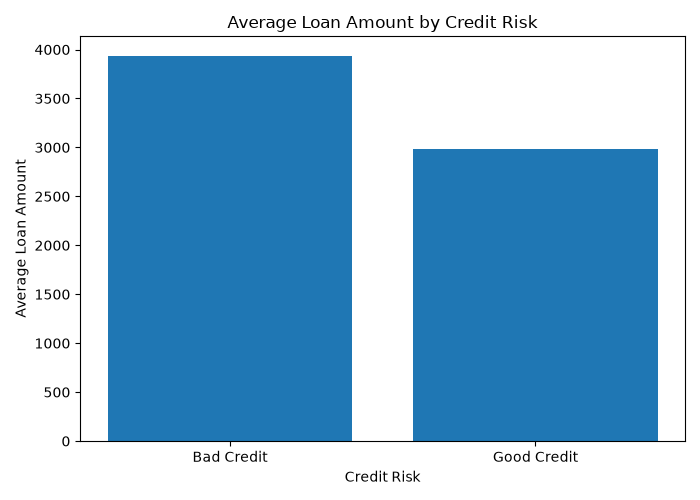
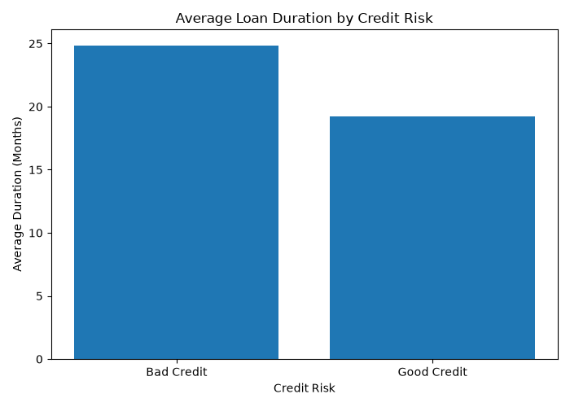

# Exploratory Data Analysis

This folder contains exploratory analysis results for the South German Credit dataset.

## Key Findings

- The dataset contains 1,000 credit records.
- 70% of applicants are classified as good credit and 30% as bad credit.
- Bad-credit applicants requested higher loan amounts on average than good-credit applicants: 3,938.13 vs 2,985.44.
- Bad-credit applicants had longer loan durations on average than good-credit applicants: 24.86 months vs 19.21 months.

## Summary Table

The summary table is saved as:

- `credit_risk_summary.csv`

## Visualizations

### Average Loan Amount by Credit Risk

### Average Loan Duration by Credit Risk

## Notes

The analysis uses the cleaned dataset:

- `data/processed/south_german_credit_clean.csv`

The target variable is:

- `credit_risk`
  - `1` = good credit
  - `0` = bad credit